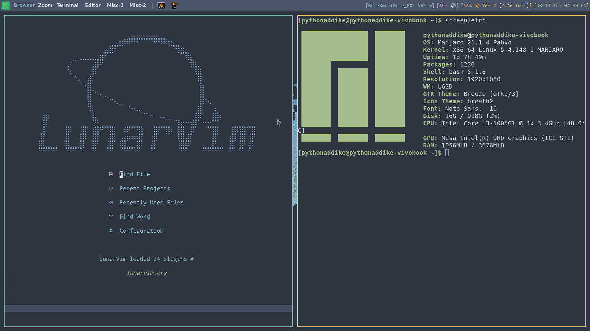
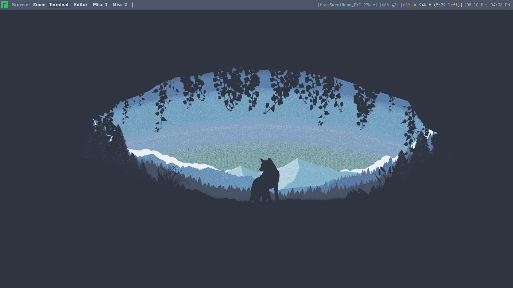

# Dotfiles Repo

Welcome! Over here, you can find my dotfiles for various applications, including `QTile`, `Alacritty`, `Kitty`, `LunarVim`, and more!

Make sure you have the following installed -
1. Qtile -
  - gnome-screenshot
  - amixer
  - brightnessctl
  - JetBrainsMono Nerd Font Mono, JetBrainsMono Nerd Font Mono Bold, DroidSansMono Nerd Font, and any emoji font of your choice

2. LunarVim -
  - Neovim 0.5 or greater
  - Python3, pip, `neovim` package
  - Node, npm

## Screenshots

